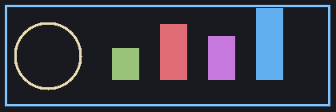

# mdt — Markdown in the Terminal

A **terminal Markdown reader** written in C++ with *graphics protocol* support
(kitty / iTerm2 / sixel) and a built-in **KaTeX-compatible** maths engine.

> Everything is compiled into a single binary: TeX → SVG rendering, the SVG
> rasteriser, image decoding and the three graphics protocols.
> 中文也支持：宽字符、断行、表格对齐都没有问题。

## Inline formatting

Text can be **bold**, *italic*, ***bold italic***, ~~struck through~~,
`inline code`, and [links](https://example.com).  Smart quotes: "quotes",
'apostrophes', em dash — and ellipsis...  Sub/superscripts like H~2~O are
written as text; Unicode √2 ≈ 1.414, 𝛼, 𝛽, π work fine.

## Maths (KaTeX syntax)

Inline maths such as $e^{i\pi} + 1 = 0$, $\alpha\beta\gamma$, or
$\sum_{k=1}^{n} \frac{1}{k^2} \to \frac{\pi^2}{6}$ flows with the text.

Display maths gets its own centred block:

$$
\int_{-\infty}^{\infty} e^{-x^{2}}\,dx = \sqrt{\pi}
$$

$$
\begin{pmatrix} a & b \\ c & d \end{pmatrix}
\begin{pmatrix} x \\ y \end{pmatrix}
= \begin{pmatrix} ax + by \\ cx + dy \end{pmatrix},
\qquad
\mathcal{L}\{f\}(s) = \int_0^\infty f(t) e^{-st}\,dt
$$

$$
\hat{H}\psi = -\frac{\hbar^2}{2m}\nabla^2\psi + V(\mathbf{r})\,\psi = E\psi
$$

## Lists

- Graphics protocol support
  - kitty (also WezTerm, Ghostty, Konsole 22+)
  - iTerm2 / WezTerm inline images
  - sixel (xterm, mlterm, foot, Windows Terminal)
- Ratio of em to cell height is derived from the terminal's font
- Nested lists work:

1. First ordered item
2. Second item, with a code span `mdt --gfx=kitty`
3. Third item
   - mixed nesting
   - still fine

## Code

```c
static struct ids *alloc_ids(size_t n)
{
        struct ids *ids = xcalloc(n, sizeof(*ids));
        ids->path = strdup("demo");
        return ids;   /* block glyphs get sprite treatment too */
}
```

```python
def fib(n: int) -> int:
    """Return the n-th Fibonacci number."""
    a, b = 0, 1
    for _ in range(n):        # loop n times
        a, b = b, a + b
    return a
```

## Tables

| Feature          | Protocol | Status | Notes                       |
|:-----------------|:---------|-------:|:----------------------------|
| Maths (KaTeX)    | images   |    OK  | TeX → SVG → PNG, 4 kSPS     |
| Inline images    | images   |    OK  | local, http(s), svg         |
| Wide characters  | text     |    OK  | CJK 宽度、emoji 宽度一致    |
| Search / outline | text     |    OK  | Tab, /, n, N                |

## Block quotes

> The art of doing mathematics consists in finding that special case which
> contains all the germs of generality.
>
> — David Hilbert
>
> > Nested quotes are supported as well.

---

## A picture



*Figure: images are scaled to the cell grid and drawn with the graphics
protocol; in sixel terminals they are quantised to 256 colours.*

Final paragraph to test the end-of-file behaviour, pgup/pgdn, and the outline
panel (press `Tab`).
